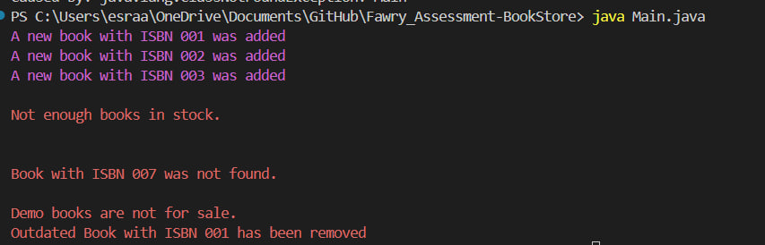
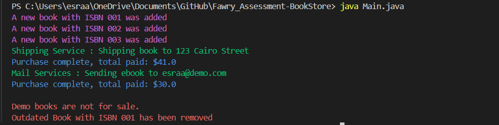
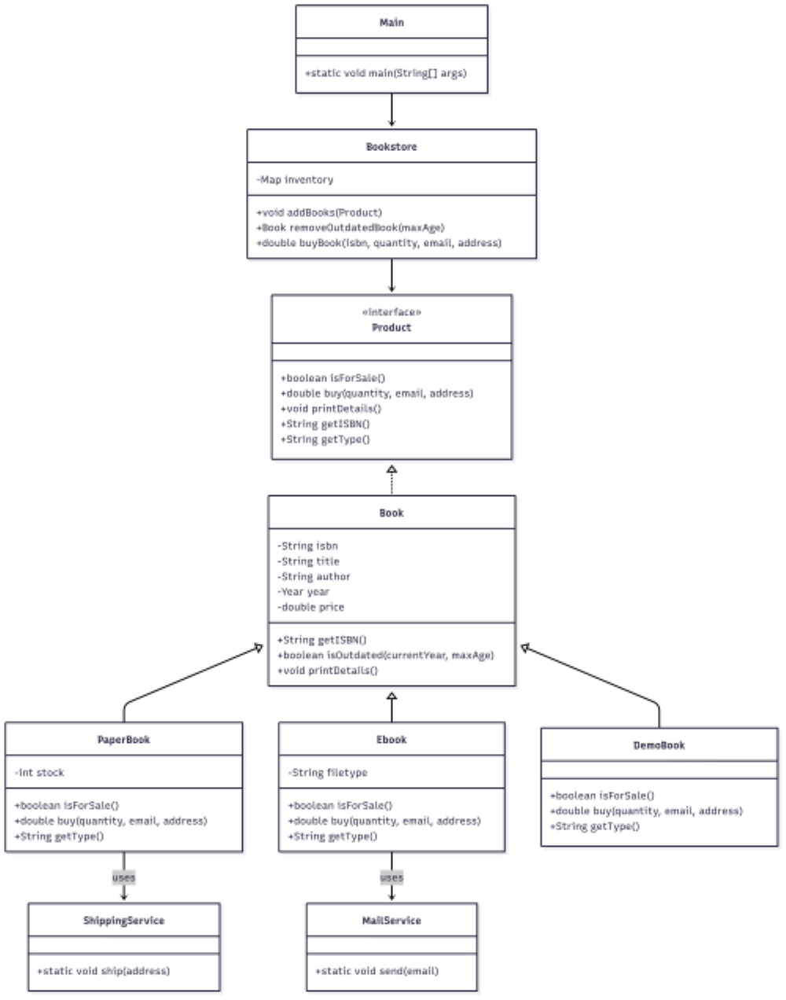

# 📚  Book Store

A simple and extensible Java-based **online bookstore system** that supports different types of books and operations like adding, buying, and removing outdated books.


---

## 🚀 Features

- 📦 Add books to the inventory:
  - `PaperBook`: physical books with stock, delivered via shipping.
  - `EBook`: digital books sent via email, identified by file type.
  - `ShowcaseBook`: demo/display books, **not for sale**.
- 🛒 Buy a book using its ISBN:
  - Automatically reduces inventory stock (if applicable).
  - Uses external `ShippingService` or `MailService` for delivery.
- 🧹 Remove outdated books:
  - Based on a maximum number of years from the current year.
- ✅ Extensible design using:
  - Interface `Product` for all sellable items.
  - Abstract class `Book` for reusable book functionality.

---

## 🧱 Class Structure

| Class                  | Description                                  |
|------------------------|----------------------------------------------|
| `Product`              | Interface for any item that can be sold      |
| `Book`                | Abstract base class implementing `Product`    |
| `PaperBook`            | Concrete subclass of `Book` (with stock)     |
| `EBook`                | Concrete subclass of `Book` (file-based)     |
| `ShowcaseBook`         | Not for sale, for display/demo only          |
| `Bookstore`     | Main manager class for book inventory        |
| `ShippingService`      | Mocked service to handle paper book delivery |
| `MailService`          | Mocked service to handle eBook delivery      |
| `Main` | Test class that runs the system           |

---

## 📸 Screenshots for the Running App

### 📖 Scenario 1



### 📖 Scenario 2


---
## 📊 UML Diagram




---

## 🛠 How to Run

1. Clone or download the project.
2. Ensure you have Java 8 or above installed.
3. Compile and run the main test class:

```bash
javac *.java
java Main


